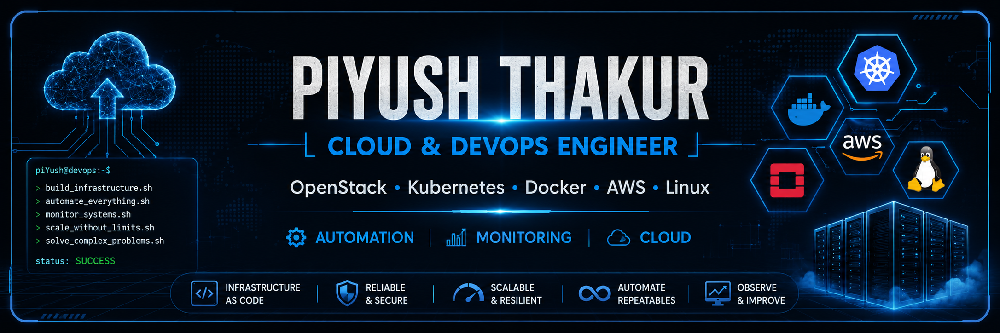

  

 

# 👋 Hi, I'm Piyush Thakur

### Cloud & DevOps Engineer

### OpenStack • Kubernetes • Docker • AWS • Ansible • Linux • Monitoring

---

*"Building reliable infrastructure through automation, scalability, and observability."*

---

## 🚀 About Me

I'm a Cloud & DevOps Engineer with nearly 4 years of experience in designing, deploying, automating, and maintaining production-inspired infrastructure.

My expertise includes private cloud platforms, container orchestration, Linux system administration, infrastructure automation, monitoring, and troubleshooting.

I enjoy solving complex infrastructure challenges by building scalable, reliable, and highly available systems.

---

## 💼 What I Do

- ☁️ OpenStack Private Cloud Administration
- ☸️ Kubernetes Cluster Management
- 🐳 Docker Containerization
- ⚙️ Infrastructure Automation using Ansible
- ☁️ AWS Cloud Services
- 🐧 Linux System Administration
- 📊 Monitoring using Prometheus & Grafana
- 📈 Infrastructure Performance Optimization
- 🔒 High Availability & Disaster Recovery
- 🚀 CI/CD & DevOps Practices

---

## 🛠 Tech Stack

### ☁️ Cloud
- OpenStack
- AWS

### 🐳 Containers
- Docker
- Kubernetes

### ⚙️ Automation
- Ansible
- Bash Shell

### 🐧 Operating Systems
- Ubuntu
- Rocky Linux
- CentOS
- Amazon Linux

### 📊 Monitoring
- Prometheus
- Grafana

### 🗄 Databases
- MySQL
- MariaDB

### 🔧 Version Control
- Git
- GitHub

---

## 🌱 Currently Learning

- Advanced Kubernetes
- Terraform
- GitHub Actions
- Production DevOps Architecture

---

## 🚀 Featured Projects

Coming Soon...

- OpenStack HA Deployment
- Kubernetes Production Cluster
- Docker Projects
- Linux Automation Scripts
- Ansible Playbooks
- Monitoring Stack
- AWS Infrastructure
- DevOps Interview Notes

---

## 📫 Connect With Me

- 💼 LinkedIn: *(Add your LinkedIn URL)*
- 📧 Email: *(Add your Email)*

---

## 💡 Quote

> **"Infrastructure should be automated, scalable, observable, and reliable—not dependent on manual operations."**

⭐ Thanks for visiting my profile!
